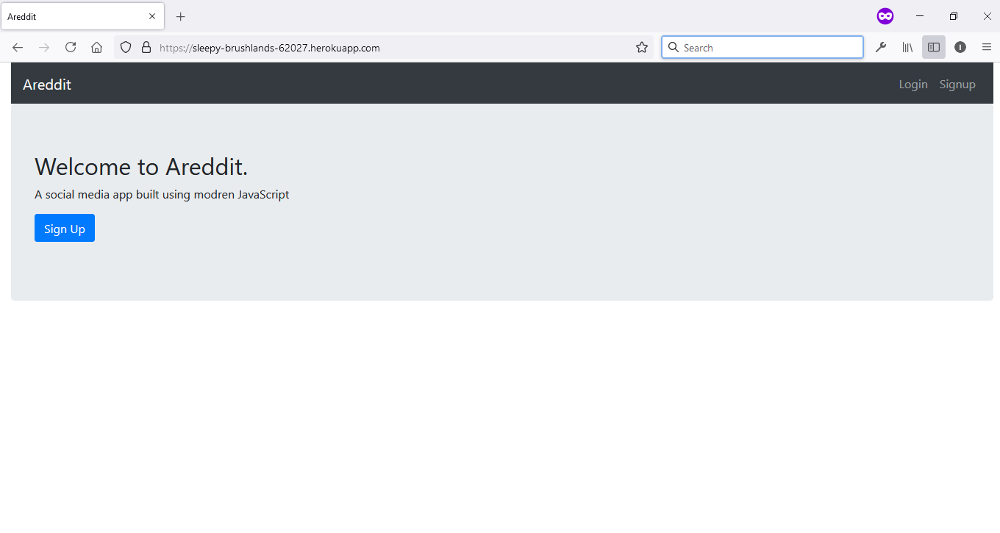
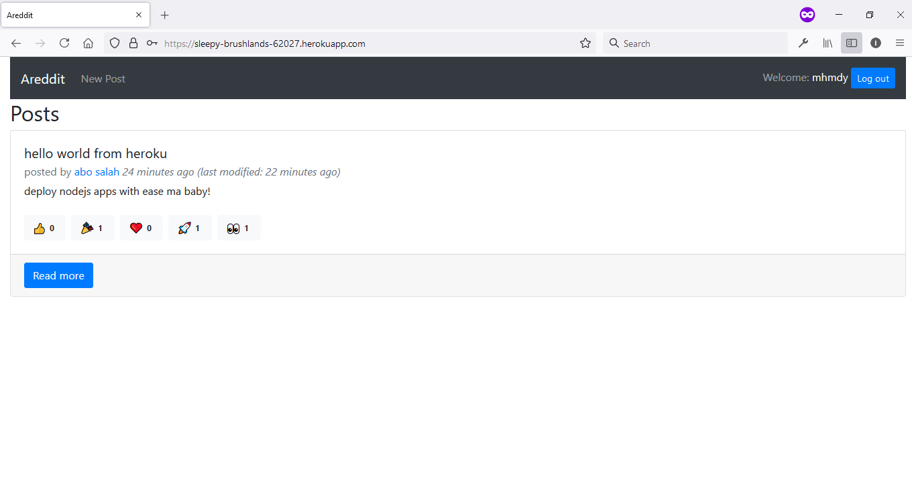

# Areddit

A soical/blogging single-page app built using MERN stack and modern JavaScript.

## Features

- User signup and login.
- Create, delete, update and read posts.
- Add comments and react to posts.
- View post user info and profile.

## TODO

- Frontend:
  - implement pagination for posts.
  - write tests for react and redux.
  - add support for rich text editor
  - design a mobile client (using react-native?)
- Backned:
  - implement pagination for posts.
  - rewrite comments/reactions logic to relate bw user <--> interaction.
  - add an expiration date for the generated JWT token.

## screenshots

<table>
<tr>
    <td></td>
    <td></td>
</tr>
</table>

More [screenshots](screenshots.md).
